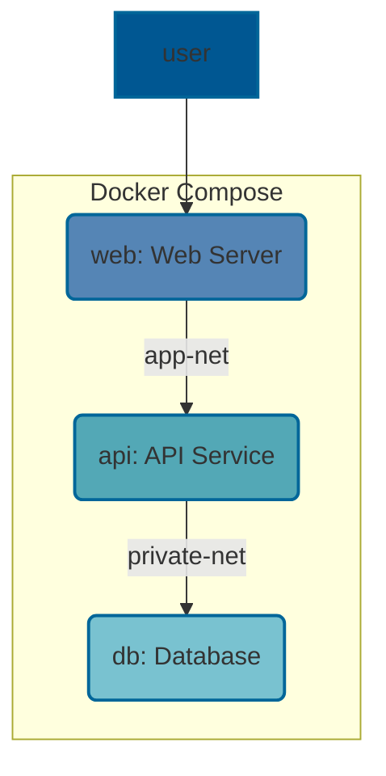

# Let's containerize the wordsmith project!


The wordsmith project is split into 3 parts:

- `web`: frontend web server written in Go
- `api`: REST API written in Java, to query the DB
- `db`: PostgreSQL database containing the words to display



Our goal is to containerize this application.

There will be 2 steps:

1. Write multiple Dockerfiles to build container images.
2. Write a Compose file, to run the app locally.


## Exercise 1: Dockerfiles

Our goal is to write Dockerfiles for the 3 containers.

First, `git clone` this repository. We need to create one
Dockerfile for each service. Pro tip: place each Dockerfile
in the corresponding directory (web, api, db).

The following paragraphs describe the installation instructions
for each service.


### web

This is a web server written in Go. To compile Go code, we can
use the `golang` [official image](https://hub.docker.com/_/golang), or install Go packages in
any of the official base images.

The entire code is in a single
source file ([dispatcher.go](web/dispatcher.go)), and should be compiled like this:

```
go build dispatcher.go
```

This creates an executable named `dispatcher`, which should be
launched like this:

```bash
./dispatcher
Listening on port 80
```

The web server needs to access the `static` directory. This directory
must be a subdirectory of the current working directory when the server is started.

Additional information:

- the server listens on port 80
- the Go compiler is only useful to build the server (not to run it)


### api

This is a REST API backend written in Java. It should be built with maven.

On a Debian or Ubuntu distribution, we can install Java and maven like this:

```bash
apt-get install maven
```

To build the program, we can invoke maven like this:

```bash
mvn verify
```

The result is a file named `words.jar`, located in the `target` directory.

The server should be started by running the following command,
in the directory where `words.jar` is located:

```
java -Xmx8m -Xms8m -jar words.jar
```

Additional information:

- the server listens on port 8080
- compilation requires `maven` (on most distributions, this will automatically install a JDK, which includes a Java compiler)
- execution doesn't require `maven` or a Java compiler; only the JRE (Java Runtime Environment) is necessary, and in Debian and Ubuntu it can be provided by the `default-jre` package


### db

This is a PostgreSQL database.

The database must be initialized with the schema (database and tables)
and the data (used by the application).

The file [words.sql](db/words.sql) contains all the SQL commands necessary to create
the schema and load the data.

Additional information:

- we strongly suggest using the [official PostgreSQL image](https://hub.docker.com/_/postgres) that can
  be found on the Docker Hub (it's called `postgres`)
- if we check the [page of that official image](https://hub.docker.com/_/postgres) on the Docker Hub, we
  will find a lot of documentation; the section "Initialization scripts" is particularly useful for understanding how to load `words.sql`
- it is advised to set up password authentication for the database; but in this case, to make our lives easier, we will simply authorize all connections (by setting environment variable `POSTGRES_HOST_AUTH_METHOD=trust`)

## Exercise 2: Compose file

When the 3 images build correctly, we can move on and write the Compose
file. We suggest placing the Compose file at the root of the repository.

At this point, we want to make sure that services can communicate
together, and that we can connect to `web`.

Note: the only `web` service should be exposed.
